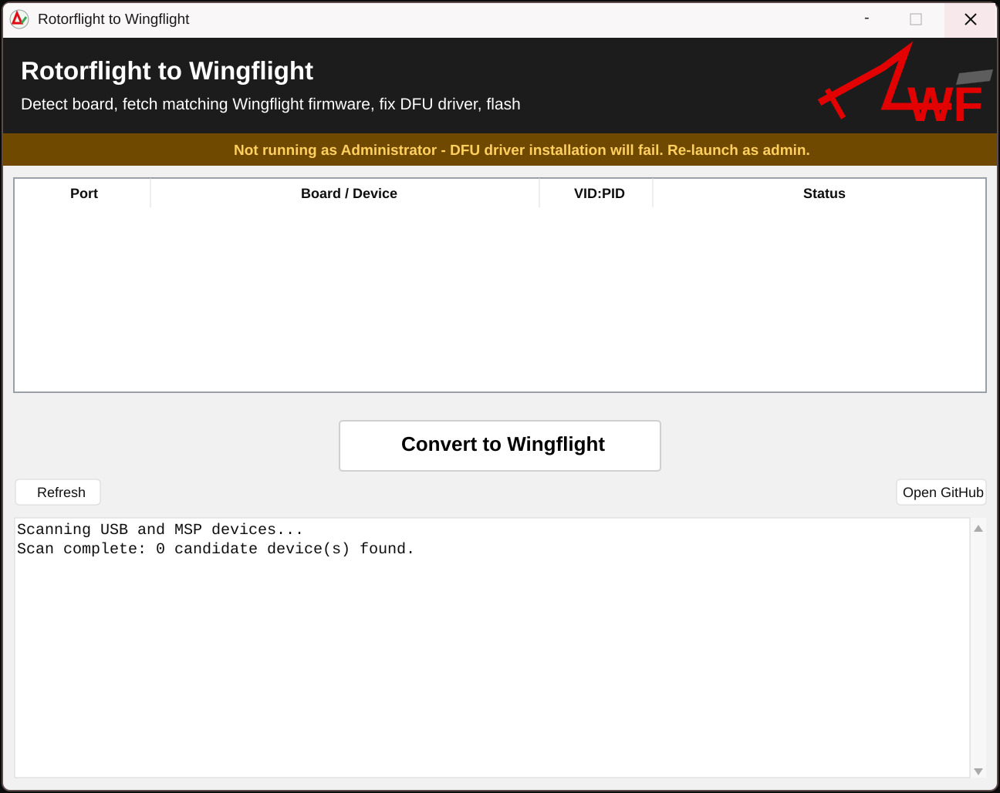

# Rotorflight to Wingflight

A small Windows Python app for helping users convert a Rotorflight flight
controller to Wingflight with one main action.



The intended flow is:

1. Detect a connected MSP flight controller and read its board information.
2. Match that board to the Wingflight unified target definition.
3. Download the newest official Wingflight release for the matching base target.
4. Fall back to the newest snapshot/prerelease build when no official release is available.
5. Reboot the board to DFU/bootloader mode.
6. Install the WinUSB DFU driver if Windows has not bound one yet.
7. Flash the downloaded firmware, including injected board defaults when required.

## Safety Note

Early bootstrap builds split sparse Intel HEX regions into separate `dfu-util`
downloads. Do not use those builds. STM32 flash erases happen at sector/page
granularity, so separate downloads can erase data written by an earlier region.
Current builds create one padded binary image from the prepared HEX and flash it
in a single `dfu-util` session.

If a board stops booting after a bad flash, the STM32 ROM bootloader should
still be recoverable: hold the board's BOOT/DFU button, or bridge the boot pads,
while plugging in USB. It should enumerate as an STM32 DFU/bootloader device so
you can reflash known-good firmware.

## Current Flashing Boundary

The app owns driver repair, board detection, release selection, firmware download,
and Intel HEX preparation. Actual DFU transfers are delegated to `dfu-util`.

On Windows, if `dfu-util` is missing, the app downloads the official
`dfu-util-0.9-win64.zip` release and installs `dfu-util-static.exe` into the
user's local app-data tools folder. You can also bundle your own copy before
building by placing it at:

```
src/tools/dfu-util.exe
```

## Run From Source

```
cd src
pip install -r requirements_converter.txt
python converter_gui.py
```

Driver installation requires an elevated Administrator process.

## Build A Standalone EXE

1. Use a Windows build host.
2. Install Python 3.9+.
3. From `src`, run:

```
make.cmd
```

The built executable is written to the repository root as:

```
rotorflight-to-wingflight.exe
```
